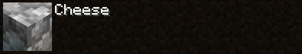

<link rel="stylesheet" href="main.css">

# Creating a Resourcepack

## Index

- [Creating a Resourcepack](#creating-a-resourcepack)
  - [Index](#index)
  - [Resources](#resources)
  - [Welcome](#welcome)
  - [Resourcepack](#resourcepack)
    - [Creating Resourcepack Folder](#creating-resourcepack-folder)
    - [Folder Name Formatting](#folder-name-formatting)
  - [Minecraft Resources](#minecraft-resources)
  - [Json in Minecraft](#json-in-minecraft)
  - [Json in Minecraft Syntax](#json-in-minecraft-syntax)
    - [Objects in Json](#objects-in-json)
    - [Keys in Json](#keys-in-json)
    - [Nested Keys](#nested-keys)
    - [Sequential Keys and Objects](#sequential-keys-and-objects)
    - [Sequential Mania](#sequential-mania)
    - [Strings in Json](#strings-in-json)
    - [Arrays in Json](#arrays-in-json)
    - [Booleans in Json](#booleans-in-json)
    - [Json Formatting](#json-formatting)
    - [Escape Characters](#escape-characters)
  - [Pack.mcmeta](#packmcmeta)
    - [`pack_format`](#pack_format)
    - [`supported_formats`](#supported_formats)
    - [`description`](#description)
    - [`Language (pack.mcmeta)`](#language-packmcmeta)

## Resources

[Resource pack, Minecraft.wiki](https://minecraft.wiki/w/Resource_pack)

[Pack Format, Minecraft.wiki](https://minecraft.wiki/w/Pack_format)

[Raw JSON text format, Minecraft.wiki](https://minecraft.wiki/w/Raw_JSON_text_format)

[Formatting Codes, Minecraft.wiki](https://minecraft.wiki/w/Formatting_codes)

[List of Unicode Characters, Wikipedia.org](https://en.wikipedia.org/wiki/List_of_Unicode_characters)

[7-Zip Website](https://www.7-zip.org/download.html)

## Welcome

In this document, I will detail an extensive list of everything you can possibly do in a resourcepack as of Java 1.20.4. This will obviously not contain *every* possible thing, as most of that knowledge already resides in the [Minecraft Wiki](https://www.minecraft.wiki/).

This document will detail step by step guide to create a resourcepack in detail. It is not aimed towards beginners, however, if you are a beginner, you are welcome to follow along but I will spend a lot of time in the specifics before a single texture file is created.

If reading is not your preference, this document has been created alongside a [youtube video of mine](https://www.youtube.com/EtomicStudios)

If you would like to the sources of the information that I present, you can go to the [resources](#resources) in the index.

With that being said, let's begin.

## Resourcepack

### Creating Resourcepack Folder

A resourcepack can either be contained withing a .zip file or a standard folder. As a resourcepack is being created, it can simply be a folder in the `resourcepacks` folder under `.minecraft`. You can also have access this folder by simply pressing `Open Pack Folder` in minecraft from the resourcepack selection screen:


Now create a folder and name it whatever you want.

### Folder Name Formatting

Whatever we call the folder or zip file will translate to the name of the resourcepack in the game itself within the resourcepack selection menu. The name of the resourcepack folder can also contain unicode unicode escape characters or the `§` character that I can't pronounce.

Currently I have called the resourcepack folder to just be `"Cheese"`. As such the folder is displayed as `"Cheese"`.

**Windows:**


**Minecraft:**



Including the `§` in the folder name, you can define what colours and styles the title of the resourcepack has.

**Windows:**


**Minecraft:**


Alternatively you can add multiple `§`. You can even combine them:

**Windows:**


**Minecraft:**


The `§r` allows you to completely reset the colours and styles that come after it's declaration, which allows you to redefine what you want without inheriting the styles previously used for what you don't want.

**Windows:**


**Minecraft:**


You can see that the last to characters in "Cheese", "`se`" has been reset to the default values. Though you can see that the foldername in windows has become unreadable, but it looks good in minecraft.

Here is a table containing all `§` codes and unicode escape characters:

|`§` Code|Unicode|Colour|
|---|---|---|
|§0|\u00a70|black|
|§1|\u00a71|dark_blue|
|§2|\u00a72|dark_green|
|§3|\u00a73|dark_aqua|
|§4|\u00a74|dark_red|
|§5|\u00a75|dark_purple|
|§6|\u00a76|gold|
|§7|\u00a77|gray|
|§8|\u00a78|dark_gray|
|§9|\u00a79|blue|
|§a|\u00a7a|green|
|§b|\u00a7b|aqua|
|§c|\u00a7c|red|
|§d|\u00a7d|light_purple|
|§e|\u00a7e|yellow|
|§f|\u00a7f|white|

|`§` Code|Unicode|Style|
|---|---|---|
|§k|\u00a7k|obfuscated|
|§l|\u00a7l|bold|
|§m|\u00a7m|strikethrough|
|§n|\u00a7n|underlined|
|§o|\u00a7o|italic|
|§r|\u00a7r|reset|

The `\u00` is a unicode escape character. It cannot be used in the title of the resourcepack as windows does not allow the use of the backslash character `\`. Though you can still use `§`.

## Minecraft Resources

Creating a resourcepack from scratch requires knowledge of knowing where each and every folder resides. Instead of constantly googling around, why not we ask Minecraft itself.

All the models and textures and literally every visual asset that Minecraft uses is stored inside a jar file that Minecraft uses as it's source of resources to load when you play the game. What we are going to do, is extract the resources and look inside the clockwork of how the game stores and uses all of the data.

To do this, if your using Minecraft's default launcher, you can simply launch the game, then go to the resourcepack selection menu. Then simply press `Open Pack Folder`.


Once you are in the folder, you can go backwards and into the `.minecraft` folder. There you can see many important folders like `resourcepacks`, which was the folder you were just in, and `saves`, which is where all of your minecraft worlds are stored. Now you should know already how to get here regardless, but this time we are going into the `versions` folder that is inside `.minecraft`.


If you have played multiple versions of Minecraft, you should see many folders containing the names of the versions of Minecraft. If you are making a resourcepack for Minecraft 1.20.4, you can go to the folder `1.20.4`, and open it up, given that you have played on that version before.


Inside you should see two files. `1.20.4.jar` and `1.20.4.json`. Our attention is focused on `1.20.4.jar`, as it contains all of the information we need.


If you are unable to see the file extensions on Windows, simply click the drop down button in your Windows Explorer, go to `View`, press `Options`, go to `View`, then scroll down and disable `Hide extensions for known file types`, then click apply.

 {#unhiding-file-name-extentions}

Now that we can see the file name extensions, we know which one of the files is the .jar. Of course if you have Java installed you would see the file type through the icon in my case, but you can never be too sure.

The next step is to extract the jar file as if we were extracting any other compressed archive. The software that I typically use for this kind of thing is [7-Zip](https://www.7-zip.org/download.html), which I prefer over other softwares like WinZip. Simply go to the download page of 7-Zip and [install it](https://www.7-zip.org/download.html).

Once you have 7-Zip, you can go to the `.jar`, right click, go to the 7-Zip section, then press `extract files`.


Now that we have the `.jar` file extracted, we can open it up and go to the `assets` folder.

Inside that folder is `.minecraft`, and now you can see all of the folders that contain the original assets used within the game. This will be useful when we need to reference what file goes where or if we need to copy a file over and modify it in our own resourcepack.

## Json in Minecraft

`Json` is an acronym for "**J**ava**S**cript **O**bject **N**otation". It is often used for storing and transporting information and data from the programming language `JavaScript`. `Json` in itself is primarily used for websites, as `JavaScript` is usually paired with `HTML` and `CSS`.

Minecraft uses `Json` to store information about object and entity models and any other important information either in raw `.json` files or `.mcmeta` files. In this case in a later chapter uses `Json` to modify the description of the resourcepack and define what version of Minecraft the resourcepack functions on.

## Json in Minecraft Syntax

As resourcepacks are indeed an artistic venture, you are often presented with programming in `Json` depending on your situation. In order to make sure that you don't have to run around the internet searching for tutorials, I will display how to write in `Json` specifically for Minecraft right here.

### Objects in Json

All data and information stored in `Json` resides in `objects {}`. Some `objects {}` has a defined name. First we create the `main object {}`, which is simply an empty set of curly brackets.

```json
{

}
```

### Keys in Json

`Objects {}` contain information called `"keys":`. A `"key":` is a `"string"` that contains a value. In this case, the `"key":` `"Cheese"` contains number `5`.

```json
{
    "Cheese": 5
}
```

We define `"keys":` names by putting them in quotations `""`, and then a colon `:` to define what the `"key":` contains.

### Nested Keys

In some cases, `"keys":` can contain `objects {}` that contain more `"keys"`.

```json
{
    "Cheese": {
        "Cheddar": 5
    }
}
```

Here `Cheese` opens up to another `object {}` and in there the `Cheese` `"key":` is now able to contain other `"keys":`.

### Sequential Keys and Objects

To have a `key` contain multiple `keys`, you must put a comma `,` at the end of every defined `key` after the value.

```json
{
    "Cheese": 1,
    "Cheese2": 2,
    "Cheese3": 3,
    "Cheese4": 4
}
```

You can see that the last defined `"key":` does not have a comma `,`, simply because it is the last `"key":` in the set, and therefore we tell `Json` that there isn't anything coming after the `Cheese4` `"key":`.

```json
{
    "Cheese": {
        "Cheddar": 1,
        "Mozzarella": 2,
        "Gouda": 3,
        "Brie": 4,
        "Feta": 5
    }
}
```

### Sequential Mania

Realistically you can mix all the examples together and have as many nested `"keys":` as you want.

```json
{
    "Cheese1": {
        "Cheddar": {
            "Count": 1,
            "Quality Rating": 5
        },
        "Mozzarella": {
            "Count": 1,
            "Quality Rating": 8
        }
    },
    "Cheese2": {
        "Cheese3": {
            "Cheese4": {
                "Cheese5": {
                    "Count": 9999999
                }
            }
        }
    }
}
```

It starts to look complicated when you have multiple nested `"keys":` put together.

### Strings in Json

Another kind of value you can assign `"keys":` is `"strings"` since `"keys":` are already technically `"strings"`. A `"string"` in programming is simply an `array []` of characters, a `"string"` of characters is just a word or a whole sentance.

```json
{
    "Cheese": "Cheese is indeed quite nice",
    "Cheese2": "Should cheese be my only example?"
}
```

### Arrays in Json

You can also assign an array of values to a `"key":`, meaning that a single `"key":` can hold multiple values instead of just one.

```json
{
    "Cheese": [
        "This is an array of text",
        "It's simply multiple strings compiled together"
    ]
}
```

`Arrays []` allow a `"key":` to contain multiple `objects {}`

```json
{
    "Cheese": [
        {
            "Yellow": "Yes it is in fact very yellow"
        },
        {
            "How Yellow?": [
                "The less yellow the more concerning",
                "But I have seen some people actually like it that way"
            ]
        }
    ]
}
```

Just like how you need a comma `,` to tell `Json` that there is another value in line, you also do it to the curly brackets `{}` to tell `Json` that there is another pair coming along.

### Booleans in Json

The last piece of information that is needed is `true` and `false` statements, or what we call a `Boolean`. They are simply the word `true` and `false` without quotations.

```json
{
    "Cheese": {
        "Is Tasty?": true,
        "Is Healthy?": false
    }
}
```

### Json Formatting

All of the examples above are written in a way that is readable. `Json` doesn't need to look like this, as everything can be written onto a single line.

```json
{"Cheese":{"Is Tasty?":true,"Is Healthy?":false},"Mozzarella Notes": ["Even though Mozzarella is good","I still prefer cheddar"]}
```

Of course this doesn't look as clean as having everything open, but in many cases this can work because `Json` allows you to type in both styles in the same document without hindering anything.

```json
{
    "Cheese": {
        "Cheddar": {"Is Good?": true, "Is Healthy?": false},
        "Mozzarella": {"Is Good?": true, "Is Healthy?": false}
    }
}
```

### Escape Characters

In `strings`, the escape character `\` is a normal backslash, but whatever comes directly after it defines what it does. This is what we call an escape sequence.

The most used escape sequence would be `\n`, which creates a new line.

```json
{
    "text": "Hello, \nWorld!"
}
```

**Output:**

```txt
Hello,
World!
```

As you can see, after placing the escape character `\`, followed by the `n`, it takes it as an instruction and makes a new line while it doesn't output the `\` or `n` literally. Though if you want a backslash in your output, you can simply place the escape character `\` twice, telling Minecraft to literally print `\`.

```json
{
    "text": "Hello\\World!"
}
```

**Output:**

```txt
Hello\World!
```

There are more escape characters, but I will list the ones that work in Minecraft that I have found so far.

|Escape Sequence|Description|
|---|---|
|\n|Creates a new line in the string|
|\\\ |Literally outputs a backslash|
|\\"|Literally outputs a quotation|
|\u|Outputs unicode character|

Now that you know a little more about `Json`, it's time to start using it practically in Minecraft.

## Pack.mcmeta

A `pack.mcmeta` file inside the `Cheese` folder is what allows minecraft to recognize that the folder is in fact a resourcepack that can be used, else if `pack.mcmeta` is not in the folder, minecraft will not see the resourcepack.

This is how the game functions with a pre-configured `pack.mcmeta` file inside the folder:


And this is the resourcepack folder without a valid `pack.mcmeta` file:


Note that the `Resourcepacks` folder displayed in the smaller images isn't the resourcepack, it's simply the folder that you put your resourcepacks inside from the `.minecraft` directory.

As you can see, the game doesn't even display a resourcepack if the `pack.mcmeta` file isn't there or the code inside the file isn't valid. The `pack.mcmeta` file requires at least the `pack_format` `"key":` and the `"description":` and `"object":` `"keys":` for minecraft to recognize the resourcepack.

Now that you understand that the game can't function without the file, create a new file and call it `pack.mcmeta`. The `.mcmeta` is the file extension minecraft uses to give the game's assets extra information for not only the metadata of the resourcepack but also metadata for textures so that we can specify whether or not the textures can animate.

If you are unable to see the file name extentions, refer to [here](#unhiding-file-name-extentions)

Once the file is created, edit it with your text editor of choice.

`.mcmeta` files borrow the syntax from the `json` language, but minecraft also directly uses `.json` files for it's 3D models and blockstates.

This is the minimum requirements `pack.mcmeta` needs in order for Minecraft to recognize the entire resourcepack.

```json
{
    "pack": {
        "pack_format": 22,
        "description": "Hello, World!"
    }
}
```


By the very least, you need a `pack_format` `object` with a number and a `description` `object` with a `string`. And often times this is all you really need. But now I will show you what all of this means.

### `pack_format`

`pack_format` determines the version of the resourcepack. Format versions may change depending on the version of minecraft, as it can jump 3 versions in between each title update. Every instance the resourcepack is modified by a snapshot or release version, the required resourcepack version changes. As of 1.20.4, the default version of the resourcepack is version 22, or `"pack_format": 22`.

```json
{
    "pack": {
        "pack_format": 22
    }
}
```

If your on the correct version, minecraft won't display any errors, but if the resourcepack's version is incorrect, then Minecraft will say `Made for an older version of Minecraft`, or `Made for a newer version of Minecraft`.

**Correct**


**Too Old**


**Too new**


### `supported_formats`

The next tag would be `"supported_formats"`. This allows you to not only tell minecraft that the resourcepack functions on a specific version of the game, but it allows you to specify a range of versions the game can recognize as a compatible resourcepack.

There are two ways of doing this. The first way is to specify an array of the range of format versions:

```json
{
    "pack": {
        "supported_formats": [13,22]
    }
}
```

Format `13` is minecraft 1.19.4's resourcepack format version, and `22` is the most recent version as of making this video, which is minecraft 1.20.4. Here we have defined that this resourcepack works on versions 1.19.4 (`13`) through 1.20.4 (`22`).

Another way you can specify the range is by instead of having an array, you can use `objects`:

```json
{
    "pack": {
        "supported_formats": {
            "min_inclusive": 13,
            "max_inclusive": 22
        }
    }
}
```

Either way works, though I suggest using the array as it is easier to remember and type.

### `description`

There are three ways you can use to create a description. The first way is to simply add text into a `string` contained in the `description` `object`:

```json
{
    "pack": {
        "description": "Hello, World!"
    }
}
```


The resourcepack selection menu allows each resourcepack description to have 2 lines, not just a single line. To write on the second line of the description, you can simple add `\n` in the text.

```json
{
    "pack": {
        "description": "Hello,\nWorld!"
    }
}
```


Above you can see `\n` is inserted in-between `"Hello,"` and `"World!"`. This will cause `"Hello,"` to be on the first line, and `"World!"` to be on the second.

You are able to add colours and effects to this text by adding unicode escape characters in the raw json string in the `description` tag.

You can either use the `§` character. The `§` is one of the more simple ways of adding colour as the only thing you need to do to add colour is by specifying what comes after it. Here is an example:

```json
{
    "pack": {
        "description": "§3Hello, World!"
    }
}
```


This sets the text colour to `dark_aqua`. You can override the colour after you have declared a `§` by simply adding another `§` soon after your last `§`. Here is an example:

```json
{
    "pack": {
        "description": "§3Hello, §fWorld§3!"
    }
}
```


As you can see this can change the colours quite well. Here is a table of all things you can do with `§` and unicodes:

|`§` Code|Unicode|Colour|
|---|---|---|
|§0|\u00a70|black|
|§1|\u00a71|dark_blue|
|§2|\u00a72|dark_green|
|§3|\u00a73|dark_aqua|
|§4|\u00a74|dark_red|
|§5|\u00a75|dark_purple|
|§6|\u00a76|gold|
|§7|\u00a77|gray|
|§8|\u00a78|dark_gray|
|§9|\u00a79|blue|
|§a|\u00a7a|green|
|§b|\u00a7b|aqua|
|§c|\u00a7c|red|
|§d|\u00a7d|light_purple|
|§e|\u00a7e|yellow|
|§f|\u00a7f|white|

|`§` Code|Unicode|Style|
|---|---|---|
|§k|\u00a7k|obfuscated|
|§l|\u00a7l|bold|
|§m|\u00a7m|strikethrough|
|§n|\u00a7n|underlined|
|§o|\u00a7o|italic|
|§r|\u00a7r|reset|

The second way is to use unicode escape characters instead of using a `§`. A unicode escape character may seem more complicated but the pattern will still remain the same:

```json
{
    "pack": {
        "description": "\u00a73Hello, \u00a7fWorld\u00a73!"
    }
}
```


As complicated as it may look, it's simply a longer version of a `§`. Previously we used a `\n` to create a new line in the json string `"Hello, World!"`. The the backslash `\` is called an escape character. This is a way to tell the game that the following text is code rather than simple text. In this case `\u00` is used for the character. You could technically type the whole alphabet with the unicode characters but I think it's better to just type in plain english, or else we might have to look at something as horrifying as this.

```json
{
    "pack": {
        "description": "\u00a73\u0048\u0065\u006C\u006C\u006F\u002c\u0020\u00a7f\u0057\u006F\u0072\u006C\u0064\u00a73\u0021"
    }
}
```


I'm not too sure why any sane person will do this but if you really really **REALLY** want to, you can.

It is possible to create an array of `strings`. By simply using square brackets `[]` you are capable of creating as many curly brackets `{}`.

```json
{
    "pack": {
        "description": [
            "Hel",
            "lo, ",
            "Wor",
            "ld!"
        ]
    }
}
```


Each new `string` does not create a new line in the resourceopack because there is no `\n` to tell the program when to create a new line. All this is is doing is putting each `string` one after the other.

Now as previously mentioned, you are able to create `strings` that allows you to format the text by adding colours and styles. But there is a far better way in the use of adding an `object` rather than a single `string`.

```json
{
    "pack": {
        "description": {
            "text": "Hello, World!",
            "color": "gold",
            "bold": true,
            "italic": true,
            "underlined": true,
            "strikethrough": false,
            "obfuscated": false
        }
    }
}
```


This way of writing does look much better compared to the other examples in terms of readability. As you might notice, the `true` and `false` statements do not use quotations.

Like with the unicode escape sequences and the `§`, I will make a list of all values you can use.

```
Colours:
    black
    dark_blue
    dark_green
    dark_aqua
    dark_red
    dark_purple
    gold
    gray
    dark_gray
    blue
    green
    aqua
    red
    light_purple
    yellow
    white

Styles:
    bold
    italic
    underlined
    strikethrough
    obfuscated
```

In more recent versions of Minecraft, you are no longer restricted to using the fixed set of colours, as now you can add in a hex colour value as a string value in the `color` object.

```json
{
    "pack": {
        "description": {
            "text": "Hello, World!",
            "color": "#ff0000",
            "bold": true,
            "italic": true,
            "underlined": true,
            "strikethrough": false,
            "obfuscated": false
        }
    }
}
```


In this case, I put in the hex code `#ff0000`, which is just really really red.

If you want to create more strings without having to retype all of the style and colour values, you can and the `extra` tag that allows you to create more strings without repeating your styes.

```json
{
    "pack": {
        "description": {
            "text": "Hello, World!",
            "color": "gold",
            "italic": true,
            "underlined": true,
            "extra": [
                {
                    "text": "\nHello, Again!",
                    "color": "dark_red"
                }
            ]
        }
    }
}
```


With the `extra` tag in use, you can add additional lines while keeping the previous values while still being able to add more specific values. You can even create nested `extra` tags by putting `extra` in every `extra`. `extra` fun!

```json
{
    "pack": {
        "description": {
            "text": "Hello, World!",
            "color": "gold",
            "italic": true,
            "underlined": true,
            "extra": [
                {
                    "text": "\nHello, Again!",
                    "color": "dark_red",
                    "extra": [
                        {
                            "text": " More Text!",
                            "color": "dark_aqua"
                        }
                    ]
                }
            ]
        }
    }
}
```


Alternatively instead of created nested `extra` tags, you can simply make the `description` tag an array.

```json
{
    "pack": {
        "description": [
            {
                "text": "#",
                "color": "gold",
                "obfuscated": true
            },
            {
                "text": "Hello, ",
                "color": "white",
                "obfuscated": false
            },
            {
                "text": "World",
                "color": "dark_red",
                "obfuscated": false
            },
            {
                "text": "!",
                "color": "white",
                "obfuscated": false
            },
            {
                "text": "#",
                "color": "gold",
                "obfuscated": true
            }
        ]
    }
}
```


Like the `extra` tag, every value here inherits the first declared `object`. In this example, that would be the `#` that is `gold` and has `obfuscated` set to `true`. As a result every `object` after it will also have `obfuscated` set to `true` by default. Of course you can set `obfuscated` to `false` if need be. This goes for colours as well.

### `Language (pack.mcmeta)`

Minecraft has many uses for the `Json` format, and one of these uses is languages. It is too early in the document to start modifying or creating languages that Minecraft can recognize.

If you do however have a language you want to modify or create entirely, you would make your language's existence known by declaring it in `pack.mcmeta`.

```json
{
    "pack": {
        "pack_format": 22,
        "description": ""
    },
    "language": {
        "en_us": {
            "name": "United States English",
            "region": "United States",
            "bidirectional": false
        }
    }
}
```

The `language` `key` comes after the `pack` `key`, and here is where we can add as many languages as we want to modify.

Firstly we have the `en_us` language already being declared. As it is already in the game, there is not much to do. There are 3 more `objects` that are additional information for the `en_us` `object`. `name`, `region`, and `bidirectional`.

The `name` of the language can honestly be whatever you want if you were making your own language. `region` is another `key` that can be called whatever you want. `bidirectional` on the other hand is an important value to set. If it is set to `true`, the language in the game when you select `en_us` in the language settings of minecraft, all the text you will have to read from right to left. But since English is a language where you read left to right, you can keep `bidirectional` set to `false`.

Declaring the `en_us` language in `pack.mcmeta` is not needed since it's already in the game. The real use of the `language` `object` is for loading custom language files which can be found in `(resourcepack name)/assets/minecraft/lang/`.

When we put `en_us` inside `pack.mcmeta`, it is looking for the language `en_us.json` in the `lang` folder. Later when we start adding custom languages, you can add it to the `pack.mcmeta` file when it's in `lang`.
